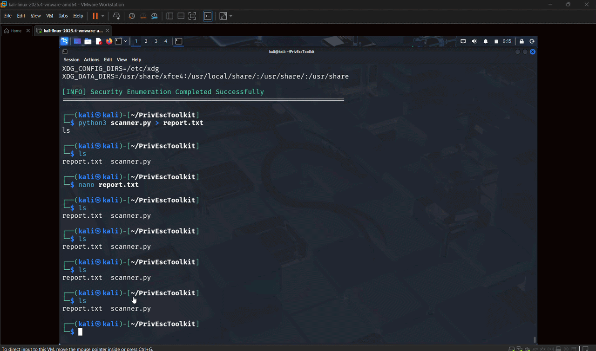

<h1 align="center">Linux Privilege Escalation Enumeration Toolkit</h1>

A minimal and practical toolkit to identify privilege escalation opportunities in Linux systems.

  
  
  

---

✦ Overview

A lightweight Python-based enumeration tool designed to surface common misconfigurations and security weaknesses that may lead to privilege escalation.

Built with simplicity and clarity in mind — focusing on real-world usability rather than complexity.

---

✦ What it does

- Scans system-level configurations
- Identifies privilege escalation vectors
- Highlights insecure permissions
- Detects writable files and SUID binaries

---

✦ Quick Start

git clone https://github.com/naba-h/linux-privilege-escalation-enumeration-toolkit.git
cd linux-privilege-escalation-enumeration-toolkit
python3 scanner.py

---

✦ Demo

  

---

✦ Output Preview

[+] Collecting system information...
[+] Checking SUID binaries...
[!] Potential privilege escalation vector found

[+] Checking writable files...
[!] Writable file detected

[+] Enumeration complete.

---

✦ Structure

.
├── scanner.py
├── report.txt
├── demo.gif
├── screenshots/
└── README.md

---

✦ Why this exists

Manual enumeration is repetitive and error-prone.
This tool provides a consistent and automated way to identify security gaps during post-exploitation.

---

✦ Use Cases

- Security labs
- CTF challenges
- Linux hardening analysis
- Penetration testing practice

---

✦ Disclaimer

For educational use only.
Do not use without proper authorization.

---

✦ Author

Naba Hanfi
https://github.com/naba-h
